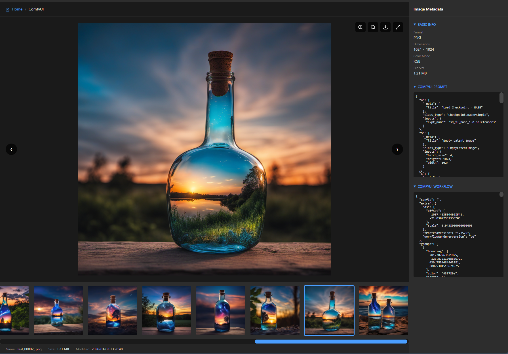
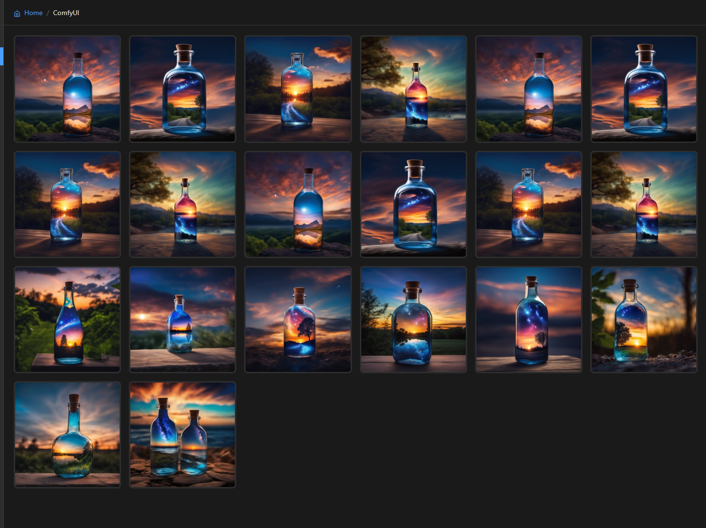
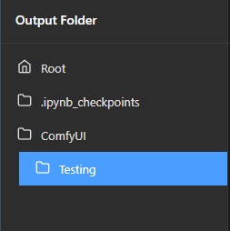
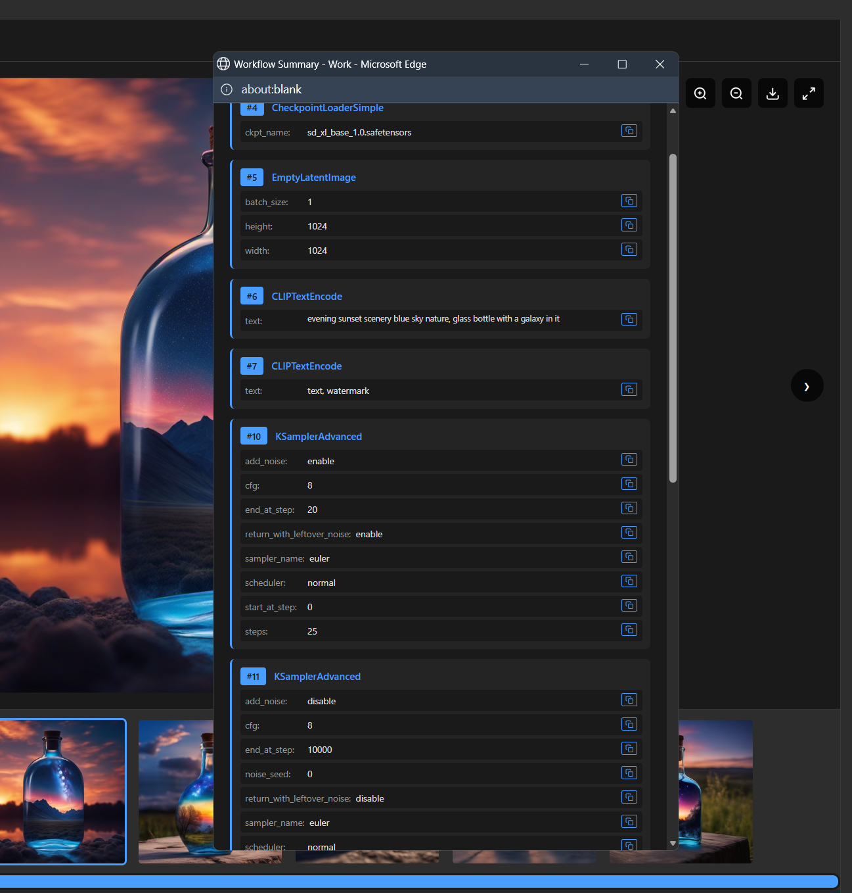

# ComfyUI Gallery

A modern, feature-rich Flask-based gallery viewer for ComfyUI outputs with dual view modes, advanced navigation, and modular architecture.

## Screenshots

### Detail View


### Grid View with Multiselect


### Folder Navigation


### Workflow Summary


## Features

### 🎨 Dual View Modes
- **Detail View**: Large image preview with horizontal thumbnail strip
- **Grid View**: Responsive grid layout for quick overview and batch operations

### 📁 Folder Navigation
- Hierarchical folder tree with expandable/collapsible structure
- Breadcrumb navigation
- Right-click context menus on folders and images
- Folder download as ZIP

### 🖼️ Image Management
- **Favorites System**: Star images to mark them as favorites
- **Favorites Filter**: Toggle view to show only favorited images
- **Persistent Storage**: SQLite database stores favorites on persistent volume
- **Multiselect**: Select multiple images with click, Ctrl+Click, or Shift+Click
- **Batch Operations**: Download or favorite/unfavorite multiple images at once
- **Single Image Actions**: Download, favorite, view metadata, copy path/workflow
- Lazy-loaded thumbnails with background generation
- Image information bar (name, size, modified date)

### 🔍 Detail View Features
- Pan and zoom controls
- Fit-to-screen mode
- One-click favorite toggle button
- Keyboard navigation (arrow keys)
- ComfyUI metadata viewer (prompt, workflow, parameters)

### 🔧 Workflow Summary
- Intelligent workflow node visualization
- Automatic extraction of key parameters (model, sampler, steps, CFG scale)
- Display prompts (positive and negative)
- LoRA detection with strength indicators
- Checkpoint and VAE information
- Collapsible sections for clean organization
- Copy individual parameters or entire workflow

### 🎯 Performance
- SQLite database with WAL mode for concurrent access
- Automatic file synchronization on startup
- Background thumbnail generation with caching
- Directory tree caching (5-minute duration)
- Optimized for large image collections
- Native browser lazy loading
- Modular JavaScript architecture for better performance

### 🎨 UI/UX
- Modern dark theme
- Minimal SVG icons
- Responsive grid layout
- Custom styled scrollbars
- Smooth transitions and animations

## Installation

### As part of Docker image:

Add to your `Dockerfile`:

```dockerfile
# Install Gallery
ARG GALLERY_VERSION=v1.0.0
ENV GALLERY_VERSION=${GALLERY_VERSION}
COPY --chmod=755 install_gallery.sh /install_gallery.sh
RUN /install_gallery.sh && \
    rm /install_gallery.sh
```

### Standalone:

```bash
git clone https://github.com/YOUR_USERNAME/comfyui-gallery.git
cd comfyui-gallery
pip install -r requirements.txt
python app.py
```

## Usage

### Environment Variables

| Variable             | Description                    | Default          |
|----------------------|--------------------------------|------------------|
| COMFYUI_OUTPUT_DIR   | Path to ComfyUI output folder  | /ComfyUI/output  |
| GALLERY_PORT         | Port to run the gallery on     | 3002             |

### Running

```bash
# Using the start script
./start.sh

# Or directly
python app.py

# Or with custom settings
COMFYUI_OUTPUT_DIR=/path/to/output GALLERY_PORT=8080 python app.py
```

### Accessing

Open your browser and navigate to:
```
http://localhost:3002
```

## API Endpoints

### Image Serving
- `GET /` - Main gallery page
- `GET /image/<path>` - Serve full-size image
- `GET /thumbnail/<path>` - Serve optimized thumbnail (300x300 JPEG)

### Data & Metadata
- `GET /api/browse` - Get root folder contents (includes favorite status)
- `GET /api/browse/<path>` - Get folder contents at path (includes favorite status)
- `GET /api/metadata/<path>` - Get ComfyUI PNG metadata (prompt, workflow)
- `GET /api/tree` - Get complete directory tree structure
- `POST /api/generate-thumbnails` - Pre-generate thumbnails in background
- `GET /health` - Health check endpoint

### Favorites
- `POST /api/favorite/<path>` - Toggle favorite status for an image
- `POST /api/favorite-batch` - Batch update favorites (set multiple images)
- `GET /api/favorites` - Get all favorited images

### Downloads
- `GET /api/download/<path>` - Download single image
- `GET /api/download-folder/<path>` - Download folder as ZIP
- `POST /api/download-multiple` - Download multiple selected images as ZIP

## Usage Guide

### Favorites System

**Marking Favorites:**
- In Detail View: Click the star button in the zoom controls (top-right)
- In Grid View: Select multiple images and click "Add to Favorites"
- Visual indicator: Gold star overlay appears on favorited images

**Viewing Favorites:**
- Click the "Favorites" button in the header toolbar
- Toggle between all images and favorites-only view
- Favorites are stored in SQLite database on persistent volume

**Batch Operations:**
- Select multiple images in Grid View
- Use "Add to Favorites" or "Remove from Favorites" buttons
- Download selected favorites together

### View Modes

**Detail View** (Default)
- Browse images with large preview and thumbnail strip
- Pan and zoom images
- Click star button to favorite current image
- View full metadata
- Navigate with arrow keys

**Grid View**
- Switch using "Grid View" button in header
- Click images to select/deselect
- Shift+Click for range selection
- Use "Download Selected" to batch download
- Batch favorite/unfavorite selected images

### Context Menu Actions

**Right-click on Images:**
- Open in Detail View
- Download Image
- Copy Image Path
- Copy Metadata as JSON
- Copy Workflow

**Right-click on Folders:**
- Open Folder
- Download Folder (as ZIP)

### Keyboard Shortcuts

**Detail View:**
- `←` / `→` - Navigate between images
- Mouse drag - Pan image
- Scroll wheel - Zoom in/out

**Grid View:**
- Click - Toggle selection
- Ctrl/Cmd + Click - Toggle individual selection
- Shift + Click - Range selection

## Project Structure

```
comfyui-gallery/
├── app.py                      # Flask backend server
├── database.py                 # SQLite database module (favorites, file sync)
├── templates/
│   └── gallery.html            # Main HTML structure (clean & minimal)
├── static/
│   ├── css/
│   │   └── gallery.css         # All styles (dark theme, layouts, animations)
│   └── js/
│       ├── gallery-state.js    # Global state management
│       ├── gallery-utils.js    # Utility functions (notifications, clipboard, etc.)
│       ├── gallery-ui.js       # UI rendering (thumbnails, grid, metadata)
│       └── gallery-core.js     # Core logic (API calls, navigation, events)
├── thumbnails/                 # Auto-generated thumbnail cache (gitignored)
├── requirements.txt            # Python dependencies (SQLite is built-in)
├── start.sh                    # Startup script
├── install_gallery.sh          # Installation script for Docker
└── README.md                   # This file
```

**Database Storage:**
- SQLite database automatically created at `{COMFYUI_OUTPUT_DIR}/.gallery_cache/gallery.db`
- Stored on persistent volume (not lost on pod restart)
- Automatic file synchronization on startup

## Technical Details

### Backend (Flask)
- **Database**: SQLite with WAL mode for concurrent read/write operations
- **File Sync**: Automatic synchronization between disk and database on startup
- **Schema Versioning**: Non-destructive migrations for database upgrades
- **Thumbnail Generation**: PIL/Pillow for optimized 300x300 JPEG thumbnails
- **Caching**: In-memory directory tree cache (5-minute TTL)
- **Threading**: Background thumbnail generation to prevent blocking
- **ZIP Creation**: In-memory ZIP file generation for downloads
- **Static File Serving**: Automatic serving of CSS/JS from `/static` directory

### Frontend (Vanilla JavaScript)
- **No Dependencies**: Pure HTML/CSS/JavaScript
- **Modular Architecture**: Organized into separate files by responsibility
  - **gallery-state.js**: Manages application state (current image, zoom level, selections)
  - **gallery-utils.js**: Reusable utilities (clipboard, notifications, formatting)
  - **gallery-ui.js**: UI rendering and updates (thumbnails, metadata, context menus)
  - **gallery-core.js**: Business logic (API calls, navigation, event handling)
- **Responsive Grid**: CSS Grid with auto-fill columns
- **SVG Icons**: Minimal Feather-style icons
- **Performance**: Separated concerns enable better code splitting and caching

## Integration with Application Manager

To add the gallery to your Application Manager config:

```json
{
  "name": "Gallery",
  "port": 3002,
  "proxy_port": 0,
  "command": "/comfyui-gallery/start.sh",
  "autolaunch": false,
  "env": {
    "COMFYUI_OUTPUT_DIR": "/ComfyUI/output",
    "GALLERY_PORT": "3002"
  }
}
```

## Development

### Running in Development Mode

```bash
# Install dependencies
pip install -r requirements.txt

# Run with debug mode
FLASK_ENV=development python app.py
```

### File Organization

When adding new features, follow this organization:

- **Styles**: Add CSS to `static/css/gallery.css`
- **State variables**: Add to `static/js/gallery-state.js`
- **Utilities**: Add helper functions to `static/js/gallery-utils.js`
- **UI components**: Add rendering functions to `static/js/gallery-ui.js`
- **Business logic**: Add API calls and handlers to `static/js/gallery-core.js`
- **HTML structure**: Modify `templates/gallery.html` only for markup changes

### Code Style

- Use clear, descriptive function names
- Group related functions together
- Add comments for complex logic
- Keep functions focused on a single responsibility
- Maintain consistent indentation (4 spaces)

## License

MIT

## Contributing

Pull requests welcome! Please ensure:
- Code follows existing modular structure
- New CSS goes in `gallery.css`, not inline
- New JS functions go in the appropriate module
- No external dependencies added without discussion
- Test with multiple browsers
- Update README for new features
- Keep file organization clean

## Changelog

### v0.4 (Current)
- **NEW**: Favorites system with SQLite database
- **NEW**: Star button in detail view to favorite images
- **NEW**: Favorites filter toggle in header toolbar
- **NEW**: Batch favorite/unfavorite in grid view
- **NEW**: Gold star overlays on favorited images
- **NEW**: Persistent storage on RunPod volume
- Database auto-sync on startup
- Icon-only zoom controls for cleaner UI

### v0.3
- Refactored to modular architecture
- Split 2478-line monolithic file into organized modules
- Improved maintainability and performance
- Better browser caching support
- Enhanced developer experience
